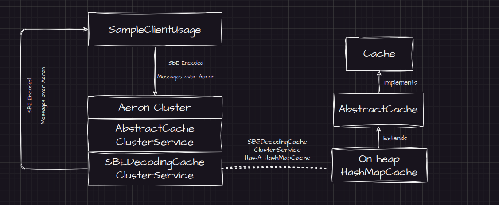

# Aeron Cache

A clustered cache built using Aeron Cluster. 
Inspired by Infinispan and Flink.

## How To Run

### Application
1. Run ClusterLauncher to spin up a 3 node cluster.
2. Run SampleClientUsage.

### JUnit Tests

```bash
./gradlew test
```

### JMH Tests

```bash
./gradlew jmh
```

### Overview




## Future Work

* Cache keys and values to be SBE encoded/decoded
* Cluster side queries via serializable consumers
* Annotation processor
* JPMS integration
* Off heap cache implementation
* Activation and passivation strategies
* Custom key entropy source

