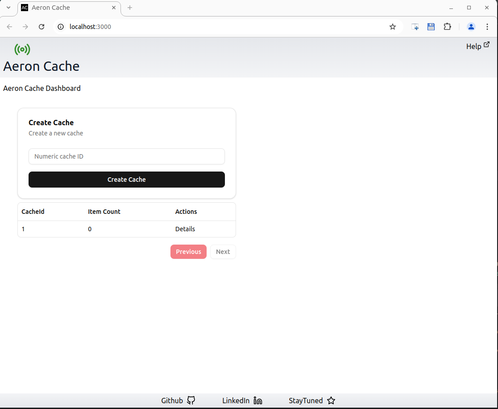
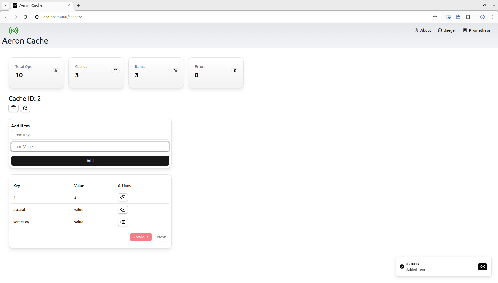
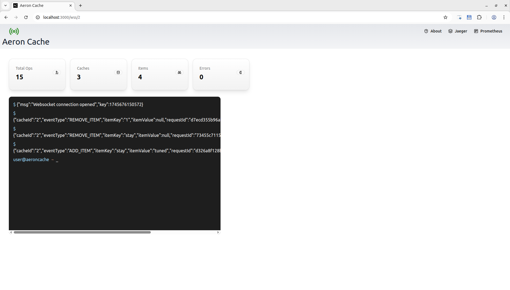

# Aeron Cache

*__Hand crafted without LLMs or Agents.__*

A clustered cache built using Aeron, Agrona and SBE. UI with NextJS, Shadcn and Tailwind. Includes HTTP and websocket interfaces with support for multi-cache joins over websocket. Prometheus+cAdvisor and tracing with Jaeger+OTEL.

## How To Run

### Docker
```bash
git clone https://github.com/bhf/aeron-cache
cd aeron-cache/
./gradlew build
docker compose build
docker compose up
```

* Frontend on localhost:3000
* HTTP API on localhost:7070
* Websocket on localhost:7071
* Jaeger tracing on localhost:16686
* Prometheus on localhost:9090
* cAdvisor on localhost:8080

### Helm and K8s

The scripts assume you've got a minikube profile setup called "aeroncache".

You can build and push images too your cluster using buildImages-minikube.sh

You can see example k8s config in folders called "k8s" in application modules.
Look for scripts called apply-k8s.sh which are used to apply the config to your minikube cluster.

You also need to open up the services, see openservices-minikube.sh

A correctly running backend setup should look something like this:

```bash 
optimus@optimus-lab:~/Workspaces/aeron-cache$ kubectl get pods
NAME                   READY   STATUS    RESTARTS      AGE
aeroncache-cluster-0   1/1     Running   1 (17m ago)   58m
aeroncache-cluster-1   1/1     Running   1 (17m ago)   58m
aeroncache-cluster-2   1/1     Running   1 (17m ago)   58m
aeroncache-http-0      1/1     Running   1 (17m ago)   45m
aeroncache-ws-0        1/1     Running   1 (17m ago)   28m
optimus@optimus-lab:~/Workspaces/aeron-cache$ kubectl get services
NAME                 TYPE           CLUSTER-IP      EXTERNAL-IP   PORT(S)          AGE
aeroncache-cluster   ClusterIP      None            <none>        <none>           58m
aeroncache-http      LoadBalancer   10.106.42.94    <pending>     7070:32531/TCP   55m
aeroncache-ws        LoadBalancer   10.109.54.228   <pending>     7070:31182/TCP   31m
kubernetes           ClusterIP      10.96.0.1       <none>        443/TCP          150m
optimus@optimus-lab:~/Workspaces/aeron-cache$ kubectl get statefulsets
NAME                 READY   AGE
aeroncache-cluster   3/3     61m
aeroncache-http      1/1     48m
aeroncache-ws        1/1     33m
optimus@optimus-lab:~/Workspaces/aeron-cache$ kubectl get configmaps
NAME                        DATA   AGE
aeroncache-cluster-config   2      59m
aeroncache-http-config      2      57m
aeroncache-ws-config        2      33m
kube-root-ca.crt            1      152m
optimus@optimus-lab:~/Workspaces/aeron-cache$ kubectl get serviceaccounts
NAME                 SECRETS   AGE
aeroncache-cluster   0         123m
aeroncache-http      0         57m
aeroncache-ws        0         33m
default              0         152m

```

In ```/k8s/helm/``` there are some Helm charts which are a work in progress.

## Subscribe to Multiple Caches over Websocket

To subscribe to cache updates on caches with IDs 808 and 333:

```bash
uwsc http://localhost:7071/api/ws/v1/caches/808,333
```

## UI







## Structure

__cache-client__ - An Aeron cluster based client for the cache.

__cache-cluster__ - The core cache cluster service.

__cache-common__ - Common entities and classes used in cache implementations.

__cache-http__ - REST interfaces around the cache-client.

__cache-ws__ - Websocket interfaces around the cache-client.

__cache-messages-sbe__ - Core SBE messages used by the cache.

__cache-messages-http__ - Messages used by HTTP interfaces to the cache.

__cache-ui__ - A UI that uses the REST API provided by cache-http-server

__k8s__ - Helm charts and other K8s resources (work in progress)

__hyperfoil__ - Some basic hyperfoil tests


## Overview

### Message Flow Overview


### Cluster Service Workflow


## Future Work

* Persisting and loading from an Image
* Non-clustered mode (single node cache)
* Industrialization and cache-ops

https://sanjdev.atlassian.net/jira/software/projects/AC/boards/22