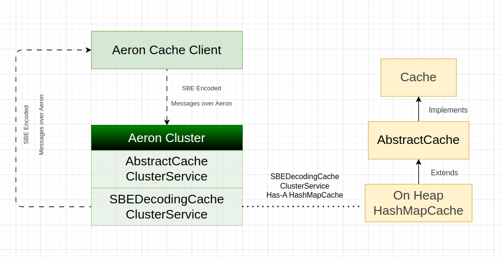
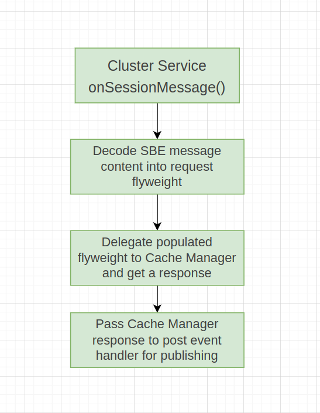
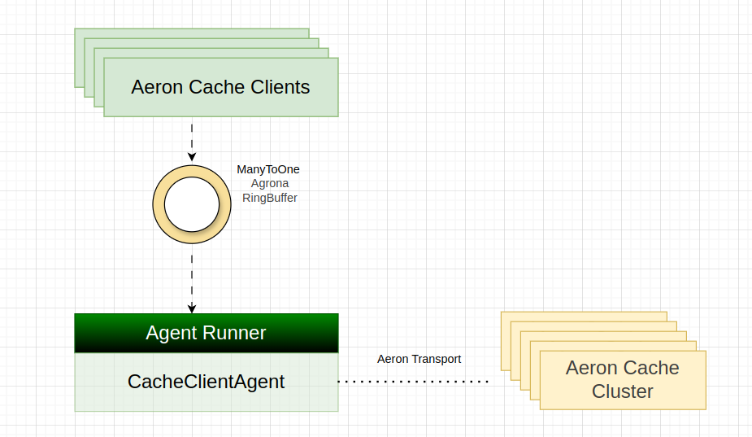
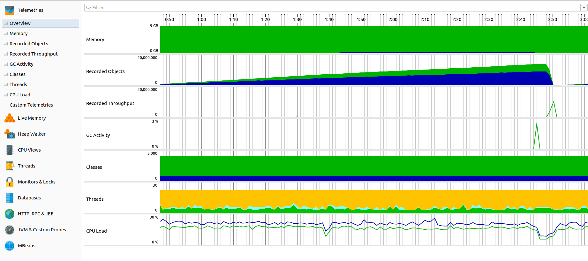
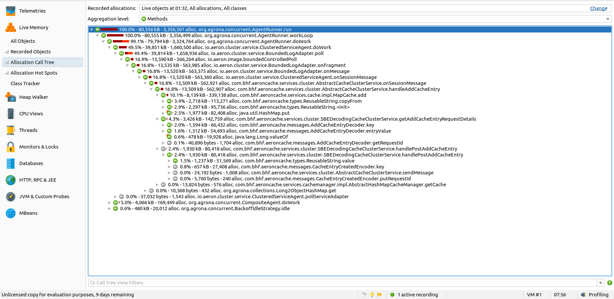

# Aeron Cache

*__Written and designed without LLMs or AI Agents.__*

A clustered cache built using Aeron, Agrona and SBE. UI with NextJS, Shadcn and Tailwind. 
Includes HTTP and websocket interfaces with support for multi-cache joins over websocket. 
Prometheus+cAdvisor and tracing with Jaeger+OTEL. 
Containerized and deployable with ```docker compose``` or on Kubernetes via ```helm``` or ```kubectl```.


https://github.com/user-attachments/assets/6f9a52bb-2251-42a0-8163-b8d8501e5c80


https://github.com/user-attachments/assets/f0418dbc-2da5-477e-8b8b-cb783836d712


## How To Run

### Docker
```bash
git clone https://github.com/bhf/aeron-cache
cd aeron-cache/
./gradlew build
docker compose build
docker compose up
```

You should see something like this once the UI is ready:

```bash
cache-ws-client-1       | Starting Websocket interface
cache-http-client-1     | Starting HTTP interface
cache-ui-1              |    ▲ Next.js 15.2.3
cache-ui-1              |    - Local:        http://localhost:3000
cache-ui-1              |    - Network:      http://0.0.0.0:3000
cache-ui-1              | 
cache-ui-1              |  ✓ Starting...

```

* Frontend on localhost:3000
* HTTP API on localhost:7070
* Websocket on localhost:7071
* Jaeger tracing on localhost:16686
* Prometheus on localhost:9090
* cAdvisor on localhost:8080

### Minikube

The scripts assume you've got a minikube profile setup called "aeroncache".

You can build and push images too your cluster using buildImages-minikube.sh

You can see example k8s config in folders called "k8s" in application modules.
Look for scripts called apply-k8s.sh which are used to apply the config to your minikube cluster.

You also need to open up the services, see openservices-minikube.sh

A correctly running backend setup should look something like this:

```bash 
optimus@optimus-lab:~/Workspaces/aeron-cache$ kubectl get pods
NAME                   READY   STATUS    RESTARTS      AGE
aeroncache-cluster-0   1/1     Running   1 (17m ago)   58m
aeroncache-cluster-1   1/1     Running   1 (17m ago)   58m
aeroncache-cluster-2   1/1     Running   1 (17m ago)   58m
aeroncache-http-0      1/1     Running   1 (17m ago)   45m
aeroncache-ws-0        1/1     Running   1 (17m ago)   28m
optimus@optimus-lab:~/Workspaces/aeron-cache$ kubectl get services
NAME                 TYPE           CLUSTER-IP      EXTERNAL-IP   PORT(S)          AGE
aeroncache-cluster   ClusterIP      None            <none>        <none>           58m
aeroncache-http      LoadBalancer   10.106.42.94    <pending>     7070:32531/TCP   55m
aeroncache-ws        LoadBalancer   10.109.54.228   <pending>     7070:31182/TCP   31m
kubernetes           ClusterIP      10.96.0.1       <none>        443/TCP          150m
optimus@optimus-lab:~/Workspaces/aeron-cache$ kubectl get statefulsets
NAME                 READY   AGE
aeroncache-cluster   3/3     61m
aeroncache-http      1/1     48m
aeroncache-ws        1/1     33m
optimus@optimus-lab:~/Workspaces/aeron-cache$ kubectl get configmaps
NAME                        DATA   AGE
aeroncache-cluster-config   2      59m
aeroncache-http-config      2      57m
aeroncache-ws-config        2      33m
kube-root-ca.crt            1      152m
optimus@optimus-lab:~/Workspaces/aeron-cache$ kubectl get serviceaccounts
NAME                 SECRETS   AGE
aeroncache-cluster   0         123m
aeroncache-http      0         57m
aeroncache-ws        0         33m
default              0         152m

```

If you apply the k8s config for cache-ui you'll see the UI components in addition to the backend:

```bash
optimus@optimus-lab:~/Workspaces/aeron-cache/cache-ui$ kubectl get services
NAME                      TYPE           CLUSTER-IP      EXTERNAL-IP   PORT(S)          AGE
aeroncache-ui-nextjs      LoadBalancer   10.106.163.22   <pending>     3000:32345/TCP   33m

optimus@optimus-lab:~/Workspaces/aeron-cache/cache-ui$ kubectl get pods -l "tier=frontend"
NAME                         READY   STATUS    RESTARTS   AGE
aeroncache-ui-nextjs-g76pw   1/1     Running   0          10m

optimus@optimus-lab:~/Workspaces/aeron-cache/cache-ui$ kubectl logs aeroncache-ui-nextjs-g76pw
   ▲ Next.js 15.2.3
   - Local:        http://localhost:3000
   - Network:      http://0.0.0.0:3000

 ✓ Starting...
 ✓ Ready in 120ms

```

### Helm Charts

In ```/k8s/helm/``` there are some Helm charts which are a work in progress (missing ancillary telemetry services and awaiting DNS resolution for UI readiness probe).

To install from Helm charts:

```bash
cd k8s/helm/
helm --namespace default upgrade -i aeroncache-cluster aeroncache-cluster/
helm --namespace default upgrade -i aeroncache-http-javalin aeroncache-http-javalin/
helm --namespace default upgrade -i aeroncache-ws-javalin aeroncache-ws-javalin/
helm --namespace default upgrade -i aeroncache-ui-nextjs aeroncache-ui-nextjs/
```

This will result in a cache-cluster with 3 pods, an instance of the HTTP interface running in a single pod as a statefulset and an
instance of the websocket interface also running in a single pod as a statefulset. The UI should also be running as a replicaset with an LB.

## Subscribe to Multiple Caches over Websocket

To subscribe to cache updates on caches with IDs 808 and 333:

```bash
uwsc http://localhost:7071/api/ws/v1/caches/808,333
```
## Structure

__cache-client__ - An Aeron cluster based client for the cache.

__cache-cluster__ - The core cache cluster service.

__cache-common__ - Common entities and classes used in cache implementations.

__cache-http__ - REST interfaces around the cache-client.

__cache-ws__ - Websocket interfaces around the cache-client.

__cache-messages-sbe__ - Core SBE messages used by the cache.

__cache-messages-http__ - Messages used by HTTP interfaces to the cache.

__cache-ui__ - A UI that uses the REST API provided by cache-http-server

__k8s__ - Helm charts and other K8s resources (work in progress)

__hyperfoil__ - Some basic hyperfoil tests


## Overview

### Message Flow Overview



### Cluster Service Workflow



### Client Flow



## Profiling





## Testing

### Unit Tests
There are approx 180 unit tests (including param variation) using JUnit and Mockito across both ```cache-cluster``` 
and ```cache-client``` which exercise the main functionality.

### JMH
There are a handful of JMH tests in ```cache-cluster``` and in ```cache-client```.

### HTTP API 
There are approx 20 HTTP based integration tests (including param variation) using JUnit and 
RestAssured in ```:cache-http:http-integration-tests``` which cover the main functionality offered by the HTTP API. 

## Future Work

* Non-clustered mode (single node cache)
* Distributed mode (data distributed across multiple single node caches)
* Industrialization and cache-ops

https://sanjdev.atlassian.net/jira/software/projects/AC/boards/22
