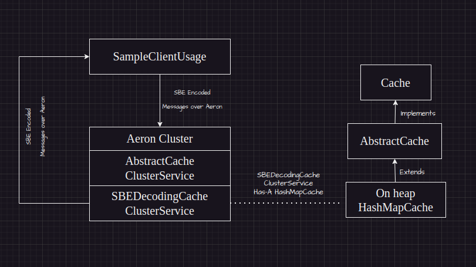
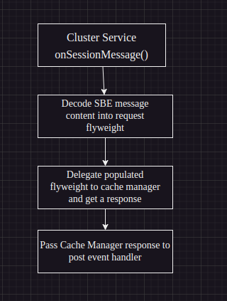

# Aeron Cache

A clustered cache built using Aeron Cluster for RAFT.

__cache-client__ - An Aeron cluster based client for the cache.

__cache-cluster__ - The core cache cluster service.

__cache-common__ - Common entities and classes used in cache implementations.

__cache-http__ - REST interfaces around the cache-client. Various implementations including Javalin.

__cache-messages-sbe__ - Core SBE messages used by the cache.

__cache-messages-http__ - Messages used by HTTP interfaces to the cache.

__cache-ui (coming soon)__ - A UI that uses the REST API provided by cache-http-server

__k8s (wip)__ - Helm charts and other K8s resources

## How To Run

### K8s and MiniKube

```bash
kubectl run aeroncache-http --image=docker.io/library/aeroncache-http --port=7070 --image-pull-policy Never
```


### Application
1. Run ClusterLauncher to spin up a 3 node cluster.
2. Run SampleClientUsage.

### Docker

To start a 3 node cluster and the sample client application:

```
docker compose up
```

Expected output:

```bash
✔ Network aeron-cache_internal_bus      Created                                                                                                                          0.5s 
 ✔ Container aeron-cache-node2-1         Created                                                                                                                         10.1s 
 ✔ Container aeron-cache-node0-1         Created                                                                                                                         10.0s 
 ✔ Container aeron-cache-node1-1         Created                                                                                                                         10.0s 
 ✔ Container aeron-cache-cache-client-1  Created                                                                                                                          0.8s 
Attaching to cache-client-1, node0-1, node1-1, node2-1
node0-1         | HOSTNAMES: [172.16.202.2, 172.16.202.3, 172.16.202.4], NODEID: 0
node0-1         | [0] Started Cluster Node on 172.16.202.2...
node0-1         | 07:55:20.856 [clustered-service-0-0] INFO  com.bhf.aeroncache.services.cluster.AbstractCacheClusterService - On start called on cluster service
node2-1         | HOSTNAMES: [172.16.202.2, 172.16.202.3, 172.16.202.4], NODEID: 2
node2-1         | [2] Started Cluster Node on 172.16.202.4...
node2-1         | 07:55:21.961 [clustered-service-0-0] INFO  com.bhf.aeroncache.services.cluster.AbstractCacheClusterService - On start called on cluster service
node1-1         | HOSTNAMES: [172.16.202.2, 172.16.202.3, 172.16.202.4], NODEID: 1
node1-1         | [1] Started Cluster Node on 172.16.202.3...
node1-1         | 07:55:22.726 [clustered-service-0-0] INFO  com.bhf.aeroncache.services.cluster.AbstractCacheClusterService - On start called on cluster service
cache-client-1  | HOSTNAMES: [172.16.202.2, 172.16.202.3, 172.16.202.4]
node0-1         | 07:55:22.886 [clustered-service-0-0] INFO  com.bhf.aeroncache.services.cluster.AbstractCacheClusterService - Node null has new role of LEADER
cache-client-1  | Sending request to create cache 1736754923534
node1-1         | 07:55:23.550 [clustered-service-0-0] INFO  com.bhf.aeroncache.services.cluster.AbstractCacheClusterService - Client session open ClientSession{id=1, responseStreamId=102, responseChannel='aeron:udp?endpoint=172.16.202.5:46532', encodedPrincipal=[], responsePublication=null, isClosing=false} on node null
node2-1         | 07:55:23.550 [clustered-service-0-0] INFO  com.bhf.aeroncache.services.cluster.AbstractCacheClusterService - Client session open ClientSession{id=1, responseStreamId=102, responseChannel='aeron:udp?endpoint=172.16.202.5:46532', encodedPrincipal=[], responsePublication=null, isClosing=false} on node null
node2-1         | 07:55:23.551 [clustered-service-0-0] INFO  com.bhf.aeroncache.services.cluster.AbstractCacheClusterService - Got create cache message for cache id 1736754923534
node1-1         | 07:55:23.551 [clustered-service-0-0] INFO  com.bhf.aeroncache.services.cluster.AbstractCacheClusterService - Got create cache message for cache id 1736754923534
node0-1         | 07:55:23.554 [clustered-service-0-0] INFO  com.bhf.aeroncache.services.cluster.AbstractCacheClusterService - Client session open ClientSession{id=1, responseStreamId=102, responseChannel='aeron:udp?endpoint=172.16.202.5:46532', encodedPrincipal=[], responsePublication=Publication{originalRegistrationId=78, registrationId=79, isClosed=false, isConnected=true, initialTermId=-1020204555, termBufferLength=16777216, sessionId=333181510, streamId=102, channel='aeron:udp?endpoint=172.16.202.5:46532', position=96}, isClosing=false} on node null
node0-1         | 07:55:23.554 [clustered-service-0-0] INFO  com.bhf.aeroncache.services.cluster.AbstractCacheClusterService - Got create cache message for cache id 1736754923534
cache-client-1  | Got client side message with TID 6
cache-client-1  | Created cache 1736754923534
cache-client-1  | Cache created with id 1736754923534
cache-client-1  | Sending request to add cache entry on cache 1736754923534
cache-client-1  | Got client side message with TID 7
cache-client-1  | Got cache entry created message for cache 1736754923534, key key1
cache-client-1  | Cache entry created cache 1736754923534
cache-client-1  | Sending request to get cache entry on cache 1736754923534
cache-client-1  | Got client side message with TID 12
cache-client-1  | Got cache entry result from cache 1736754923534 with key key1, value {msgType: "D"}
cache-client-1  | Cache entry GET on cache 1736754923534
cache-client-1  | Sending request to remove cache entry on cache 1736754923534 with key: key1
cache-client-1  | Got client side message with TID 8
cache-client-1  | Got cache entry removed for cache 1736754923534, key key1
cache-client-1  | Cache entry removed on cache 1736754923534
cache-client-1  | Sending request to get cache entry on cache 1736754923534
cache-client-1  | Got client side message with TID 12
cache-client-1  | Got cache entry result from cache 1736754923534 with key key1, value 
cache-client-1  | Cache entry GET on cache 1736754923534
cache-client-1  | Sending request to clear cache on cache 1736754923534
cache-client-1  | Got client side message with TID 9
cache-client-1  | Got cache cleared on cache 1736754923534
cache-client-1  | Cache cleared on cache 1736754923534
cache-client-1  | Sending request to delete cache on cache 1736754923534
cache-client-1  | Got client side message with TID 10
cache-client-1  | Got cache deleted on cache 1736754923534
cache-client-1  | Cache deleted on cache 1736754923534


```

### JUnit Tests

```bash
./gradlew test
```

### JMH Tests

```bash
./gradlew jmh
```

### Overview

#### Message Flow Overview



#### Cluster Service Workflow



## Future Work

* Cache keys and values to be SBE encoded/decoded
* Cluster side queries via serializable consumers
* Annotation processor
* Startup and periodic snapshot handling 
* Off heap cache implementation
* Activation and passivation strategies
* Custom key entropy source

https://sanjdev.atlassian.net/jira/software/projects/AC/boards/22