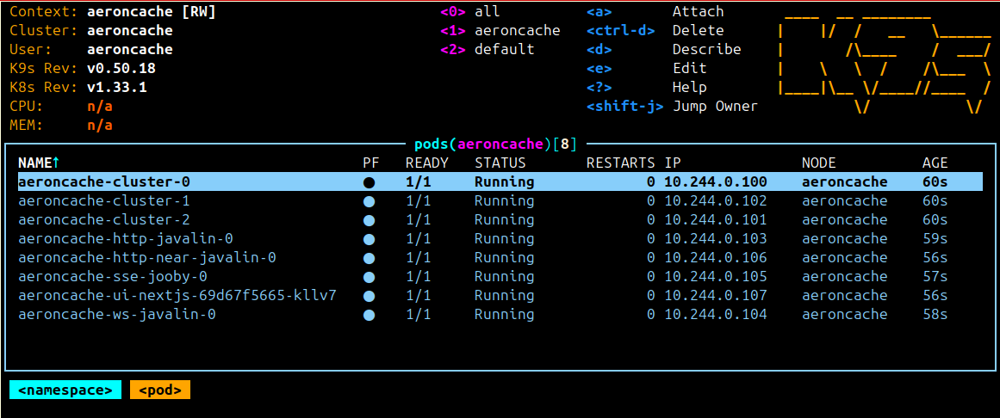
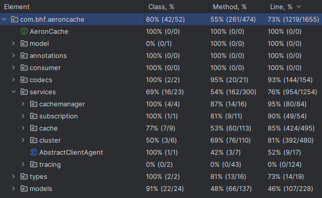

# Aeron Cache


*__Written and designed without LLMs or AI Agents.__*

A key value store built using Aeron, Agrona and SBE. RAFT clustered and fast by default. UI with NextJS, Shadcn and Tailwind. 
Includes HTTP, WS and SSE interfaces with support for multi-cache joins over WS and SSE. 
Prometheus+cAdvisor and tracing with Jaeger+OTEL. 
Containerized and deployable with ```docker compose``` or on Kubernetes via ```helm``` or ```kubectl```.

Features:

* Clustered and single node modes
* Near cache implementation (read ahead)
* Embedded cache [polyglot clients](https://github.com/bhf/aeron-cache-embedded) in Java, Rust, Typescript and Python
* Rust based [CLI](https://github.com/bhf/aeron-cache-cli)
* An MCP server to power your Agentic AI and LLM workflows


https://github.com/user-attachments/assets/c602f365-2b6a-497c-a671-29508cc04155


https://github.com/user-attachments/assets/cdbf0e54-2ff8-47c4-8a98-50a8104de6fd


* [How To Run - Docker](#docker)
* [How To Run - K8s/Helm](#k8s-and-helm)
* [Multi-cache Subscriptions](#subscribe-to-multiple-caches)
* [Project Structure](#structure)
* [Overview](#overview)
* [Testing](#testing)
* [Roadmap](#future-work)

## How To Run

### Docker
```bash
git clone https://github.com/bhf/aeron-cache
cd aeron-cache/
./gradlew build
docker compose build
docker compose up
```

You should see something like this once the UI is ready:

```bash
cache-ws-client-1       | Starting Websocket interface
cache-http-client-1     | Starting HTTP interface
cache-ui-1              |    ▲ Next.js 15.2.3
cache-ui-1              |    - Local:        http://localhost:3000
cache-ui-1              |    - Network:      http://0.0.0.0:3000
cache-ui-1              | 
cache-ui-1              |  ✓ Starting...

```

You can also spin up a single node cache by using ```docker-compose-nonclustered.yaml```

[Top](#aeron-cache)

### K8s and Helm

The ```Makefile``` is setup to push images to Minikube.

```bash
git clone https://github.com/bhf/aeron-cache
cd aeron-cache/
make all
cd k8s/helm/
make install-all
```



[Top](#aeron-cache)

## Subscribe to Multiple Caches

To subscribe to cache updates on caches with IDs 808 and 333:


```bash
uwsc http://localhost:7071/api/ws/v1/caches/808,333
```

You can also do this over SSE:

```bash
http://localhost:7072/api/sse/v1/caches/808,333
```

[Top](#aeron-cache)

## Structure

__cache-client__ - An Aeron cluster based client for the cache.

__cache-cluster__ - The core cache cluster service.

__cache-common__ - Common entities and classes used in cache implementations.

__cache-http__ - REST interfaces around the cache-client.

__cache-mcp__ - MCP interface using the Swagger spec with AutoMCP. 

__cache-ws__ - Websocket interfaces around the cache-client.

__cache-sse__ - SSE interfaces around the cache-client.

__cache-messages-sbe__ - Core SBE messages used by the cache.

__cache-messages-http__ - Messages used by HTTP interfaces to the cache.

__cache-near__ - Near cache implementation with a HTTP interface.

__cache-ui__ - A UI that uses the REST API provided by cache-http-server

__k8s__ - Helm charts and other K8s resources (work in progress)

__hyperfoil__ - Some basic hyperfoil tests

[Top](#aeron-cache)

## Overview

### Message Flow Overview


### Cluster Service Workflow


### Client Flow


[Top](#aeron-cache)


## Testing

### Unit Tests
There are a number of unit tests (including some param variation) using JUnit and Mockito across both ```cache-cluster``` 
and ```cache-client``` which exercise the main functionality.

Core coverage > 70% (as of 4th July 2025)




### JMH
There are a handful of JMH tests in ```cache-cluster``` and in ```cache-client```.

### Integration Tests

There are various integration test suites in ```:cache-integration``` which use TestContainers. These are generally broken 
down by environment/backend configuration combinations. 

[Top](#aeron-cache)

## Future Work

* Industrialization and cache-ops

https://sanjdev.atlassian.net/jira/software/projects/AC/boards/22

[Top](#aeron-cache)
