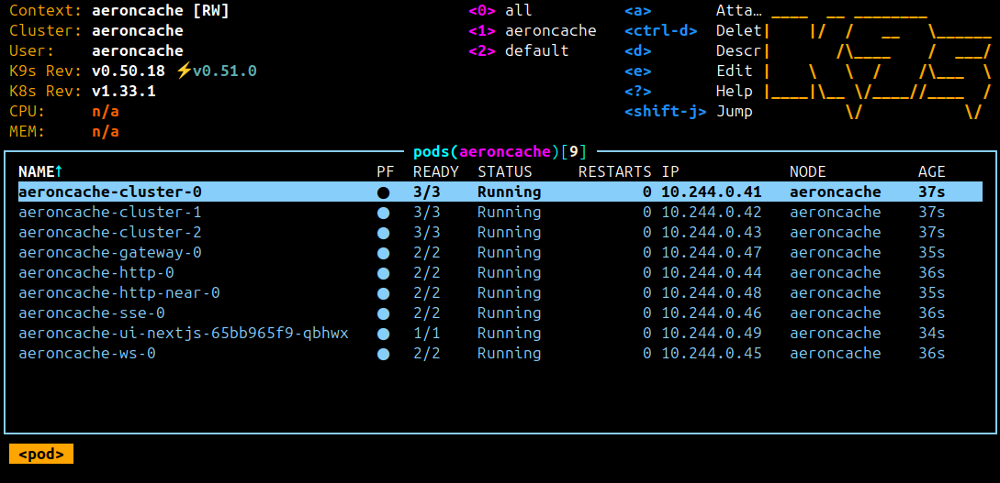

# Aeron Cache


[](https://github.com/bhf/aeron-cache/actions/workflows/ci.yaml)
[](https://github.com/bhf/aeron-cache/actions/workflows/ui-ci.yaml)
[](https://github.com/bhf/aeron-cache/actions/workflows/helm-ci.yaml)
[](https://github.com/bhf/aeron-cache/actions/workflows/helm-ci-ephemeral.yaml)
[](https://github.com/bhf/aeron-cache/actions/workflows/helm-ci-monolith.yaml)
[](https://github.com/bhf/aeron-cache/actions/workflows/microbenchmarks.yml)
[](https://github.com/bhf/aeron-cache/actions/workflows/soak-core-cache.yml)
[](https://github.com/bhf/aeron-cache/actions/workflows/soak-streaming.yml)
[](https://github.com/bhf/aeron-cache/actions/workflows/soak-bidi-ws.yml)
[](https://github.com/bhf/aeron-cache/actions/workflows/soak-streaming-ws.yml)
[](https://github.com/bhf/aeron-cache/actions/workflows/soak-sse.yml)

A key value store with counters built using Aeron, Agrona and SBE. RAFT clustered or single node - fast by design. UI with NextJS, Shadcn and Tailwind. 
Includes HTTP, WS and SSE interfaces with support for multi-cache joins over WS and SSE.
Containerized and deployable with ```docker compose``` or on Kubernetes via ```helm``` or ```kubectl```.

Features:

* Key-value and counter caches with item level TTL support
* Bulk atomic operations across caches and counters
* Streaming multi-cache (and key) subscriptions
* HTTP (Request-Response), WS (UniDi and BiDi), SSE (UniDi) and SBE-Aeron (BiDi) APIs
* PATCH support for writing partial updates to JSON values including partial streaming subscriptions (JSON Merge Patch RFC 7386)
* Clustered and single node modes
* Run as a single monolith or separate horizontally scalable services
* Near cache implementation (read ahead)
* Embedded cache [polyglot clients](https://github.com/bhf/aeron-cache-embedded):
  * Aeron Transport (BIDI) - Java and Rust
  * HTTP and WS - Java, Rust, Typescript and Python
* Rust based [CLI](https://github.com/bhf/aeron-cache-cli)


https://github.com/user-attachments/assets/c602f365-2b6a-497c-a671-29508cc04155


https://github.com/user-attachments/assets/cdbf0e54-2ff8-47c4-8a98-50a8104de6fd


* [How To Run - Brew](#brew)
* [How To Run - K8s/Helm](#k8s-and-helm)
* [API Specs](#api-specs)

## How To Run

### Brew
```bash
brew tap bhf/aeron-cache
brew install aeron-cache
aeron-cache
```

You should see something like:

```bash
Initializing Aeron Cache...

    ___    __________  ____  _   __   _________   ________  _________
   /   |  / ____/ __ \/ __ \/ | / /  / ____/   | / ____/ / / / ____/
  / /| | / __/ / /_/ / / / /  |/ /  / /   / /| |/ /   / /_/ / __/   
 / ___ |/ /___/ _, _/ /_/ / /|  /  / /___/ ___ / /___/ __  / /___   
/_/  |_/_____/_/ |_|\____/_/ |_/   \____/_/  |_\____/_/ /_/_____/   

              🌲 https://github.com/bhf/aeron-cache 🌲

✅ Aeron Cache is running!
   UI      : http://localhost:3000
   Backend : PID 6221
   Config  : /home/user1/.aeron-cache
   Log     : /home/user1/.aeron-cache/aeron-cache.log

Press Ctrl+C to stop.
```

[Top](#aeron-cache)

### K8s and Helm

The ```Makefile``` is setup to push images to Minikube.

```bash
git clone https://github.com/bhf/aeron-cache
cd aeron-cache/
make all
cd k8s/helm/
make install-all
```



[Top](#aeron-cache)

## API Specs

* [REST OpenAPI](cache-http/openapi.yml)
* [Streaming Websocket OpenAPI](cache-ws/ws-openapi.yaml)
* [SSE OpenAPI](cache-sse/sse-openapi.yaml)
* [BiDi Websocket OpenAPI](cache-ws/bidi-ws-openapi.yaml)
* [Aeron Transport Gateway SBE](cache-aeron-gateway/aeron-gateway-server/src/main/resources/sbe/gateway-schema.xml)


[Top](#aeron-cache)


